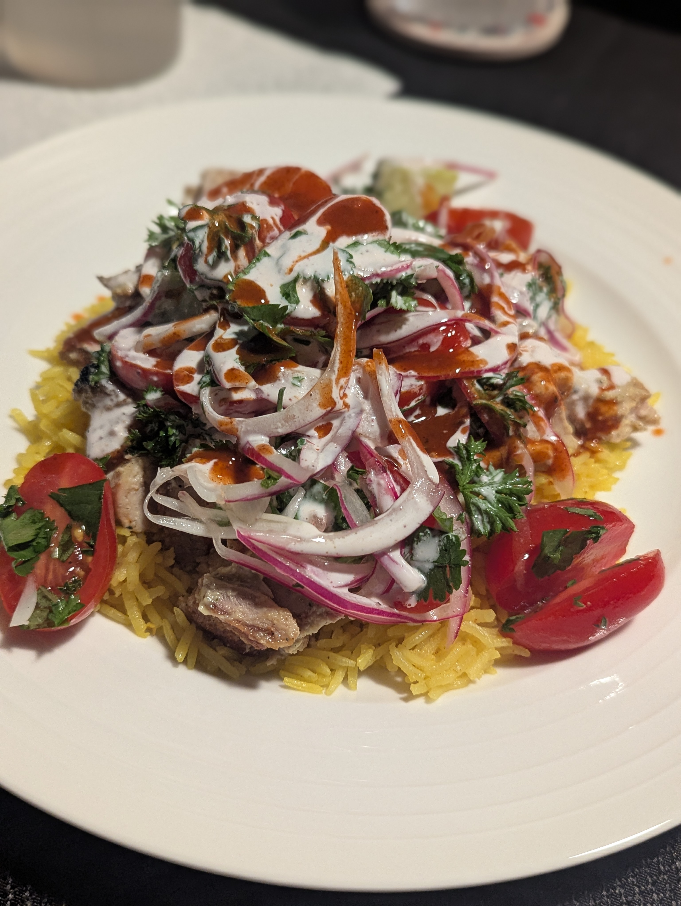

This is a mix of three different recipes.

- [Serious Eats](https://www.seriouseats.com/serious-eats-halal-cart-style-chicken-and-rice-white-sauce-recipe) for the chicken and rice
- [Thrillist](https://www.thrillist.com/recipe/new-york/halal-white-sauce-thrillist-recipes) for the white sauce
- Salad is simply a common mix of greens for a light topping.

## Ingredients

#### Chicken

- 2 tablespoons fresh lemon juice

- 1 tablespoon chopped fresh oregano

- 1/2 teaspoon ground coriander seed

- 3 garlic cloves, roughly chopped (about 1 1/2 tablespoons)

- 1/4 cup light olive oil

- Kosher salt and freshly ground black pepper

- 2 pounds boneless, skinless chicken thighs, trimmed of excess fat (6 to 8 thighs)

- 1 tablespoon vegetable or canola oil

#### Rice

- 2 tablespoons unsalted butter

- 1/2 teaspoon turmeric

- 1/4 teaspoon ground cumin

- 1 1/2 cups long-grain or Basmati rice

- 2 1/2 cups chicken broth

- Kosher salt and freshly ground black pepper

#### White Sauce

- 1 cup mayonnaise (try to find one made of only egg yolks, not whole eggs)

- ¼ cup water

- 2 tablespoons fresh lemon juice

- ¼  teaspoon ground caraway

- ¼  teaspoon ground sumac

- ¼ teaspoon ground cardamom

- Just a sprinkle of ground turmeric

- Pinch of xanthan gum

- Freshly ground black pepper to taste

#### Salad

- Grape tomatoes, halved

- Cucumber, chopped

- Cilantro, chopped

- Red Onion, thinly sliced, optionally pickled. After slicing, add onion to an ice water bath.

- Olive Oil

- Lemon Juice

- Salt and Pepper

## Directions

#### Chicken

1. For the chicken: Combine the lemon juice, oregano, coriander, garlic, and olive oil in a blender. Blend until smooth. Season the marinade to taste with kosher salt and black pepper. Place the chicken in a 1-gallon zipper-lock bag and add half of the marinade (reserve the remaining marinade in the refrigerator). Turn the chicken to coat, seal the bag, and marinate the chicken in the refrigerator for at least 1 hour and up to 4 hours, turning occasionally to redistribute the marinade. Do not marinate the chicken longer than 4 hours or it’ll get a mushy texture. If you must delay cooking the chicken for any reason, remove it from the marinade, pat it dry with paper towels, and refrigerate until ready to cook.

1. Remove the chicken from the bag and pat it dry with paper towels. Season with kosher salt and pepper, going heavy on the pepper. Heat the oil in a 12-inch heavy-bottomed cast iron or stainless-steel skillet over medium-high heat until it is lightly smoking. Add the chicken pieces and cook without disturbing until they are lightly browned on the first side, about 4 minutes. Using tongs, flip the chicken. Reduce the heat to medium and cook until the chicken is cooked through and the center of each thigh registers 165°F. on an instant-read thermometer, about 6 minutes longer. Transfer the chicken to a cutting board and allow to cool for 5 minutes.

1. Using a chef’s knife, roughly chop the chicken into 1/2- to 1/4-inch chunks. Transfer to a medium bowl, add the remaining marinade, cover loosely with plastic, and refrigerate while you cook the rice and prepare the sauce.

#### Rice

1. Melt the butter over medium heat in a large Dutch oven. Add the turmeric and cumin and cook until fragrant but not browned, about 1 minute. Add the rice and stir to coat. Cook, stirring frequently, until the rice is lightly toasted, about 4 minutes. Add the chicken broth. Season to taste with salt and pepper. Raise the heat to high and bring to a boil. Cover, reduce to a simmer, and cook for 15 minutes without disturbing. Remove from the heat and allow to rest until the water is completely absorbed and the rice is tender, about 15 minutes.

#### White Sauce

1. Whisk mayonnaise, water, and lemon juice together until smooth and no lumps appear.

1. Add caraway, sumac, cardamom, and turmeric; stir until combined.

1. Add xanthan gum and mix until it thickens slightly.

1. Add black pepper to taste.

1. Store in the refrigerator. Use liberally.

#### Salad

1. Combine the tomatoes, greens, and onion in a bowl.

1. Whisk together oil and lemon juice and season to taste with salt and pepper.

1. Lightly dress the salad before serving.

## Notes

Serve with hot sauce. I like [Dave's Gourmet Hurtin' Habanero Hot Sauce](https://www.amazon.com/dp/B0000DID5V?ref_=ppx_hzsearch_conn_dt_b_fed_asin_title_1).

Rather than cooking the chicken on the stove top, I've found it to be easier, cleaner, and faster to just broil it.

I've skipped the xanthum gum in the white sauce and it's fine.
The sauce is a bit runny, but no complaints!
